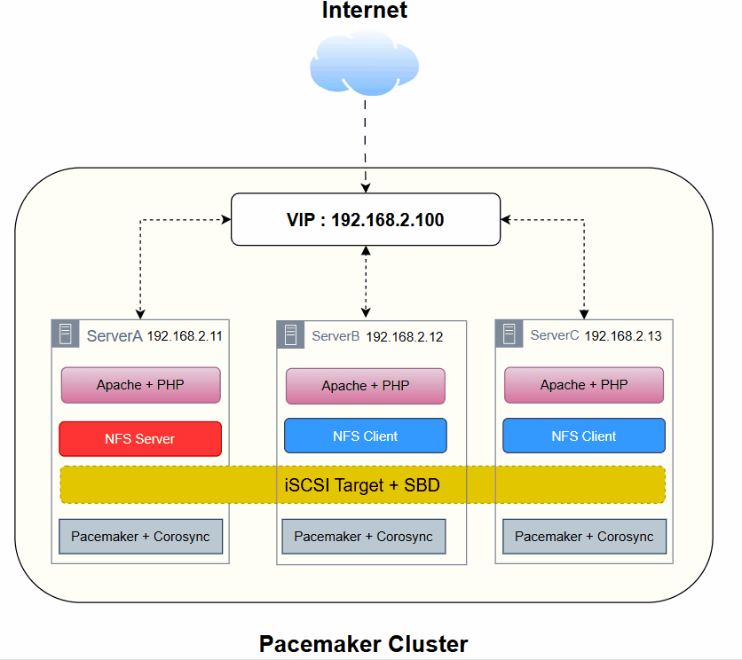

# 🛠️ High Availability Web Cluster with Pacemaker

## 🧠 Architecture Diagram

## 📘 Overview

This project presents a **fully configured High Availability (HA) Web Cluster** built using enterprise-level open-source tools on three CentOS VMs: `serverA`, `serverB`, and `serverC`. The cluster ensures **continuous service availability**, **automated failover**, and **node fencing** using **SBD (Storage-Based Death)**.

It showcases how to:

- Design a fault-tolerant infrastructure
- Implement automated service failover
- Use iSCSI as shared fencing storage
- Deploy Apache across nodes with a shared dynamic web app

---

## 🧱 Project Components

| Component | Description |
| --- | --- |
| **Pacemaker** | Cluster Resource Manager – handles starting/stopping resources |
| **Corosync** | Messaging layer – ensures node membership and communication |
| **PCS** | CLI tool to configure and manage clusters |
| **Apache (httpd)** | Web server used to host a PHP-based dynamic page |
| **NFS** | Network File System for shared website files across nodes |
| **SBD** | Watchdog-based fencing tool using a shared disk to ensure split-brain prevention |
| **iSCSI** | Used to create a shared block storage device between nodes for fencing |
| **Virtual IP (VIP)** | Shared floating IP that ensures client traffic always reaches the active node |

---

## 🎯 Project Goals

- ✅ **Achieve High Availability**: Ensure the service remains available even if one or two nodes fail.
- ✅ **Fencing via SBD**: Avoid split-brain scenarios by isolating unresponsive nodes.
- ✅ **Shared Web Content**: Ensure consistent content using NFS across all web servers.
- ✅ **Dynamic Node Detection**: Web page shows which node is actively serving traffic.
- ✅ **Auto Failover**: Automatically relocate VIP and Apache to a healthy node on failure.

---

## 📝 Documentation

This project can be set up in **two different methods**:

1. **Manual Setup**: This approach involves manually configuring each component of the High Availability Cluster on the CentOS VMs. You can follow the step-by-step instructions in the documentation [here](manual-setup-link) to achieve the desired HA setup.

2. **Automated Setup with Ansible**: This approach automates the entire setup process using Ansible playbooks. If you prefer to automate the configuration, you can use the [automated setup documentation](automated-setup-link) to get the cluster up and running with just a few commands.

Both methods provide the same end result but cater to different preferences: manual control vs automation.

---

## 🔗 Links to Resources

- **Manual Setup Documentation**: [Manual Setup Guide](manual-setup-link)
- **Automated Setup with Ansible**: [Automated Setup Guide](automated-setup-link)
